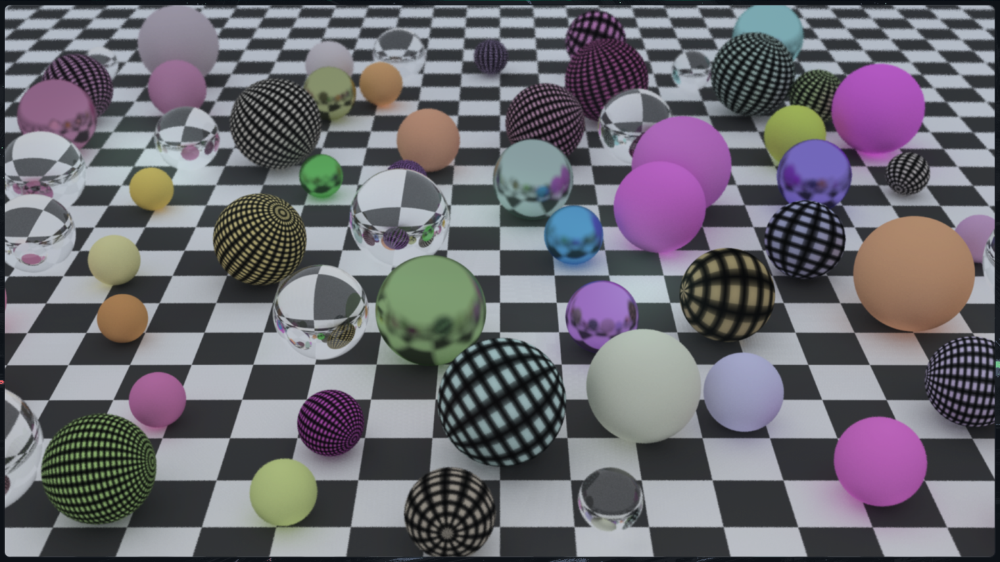

# ShaderEngine

[](https://www.rust-lang.org/)
[](https://choosealicense.com/licenses/mit/)

**ShaderEngine** is a Rust OpenGL engine designed for shader development and experimentation. It includes everything
you need to build, test shader projects...

---

## 🧭 Table of Contents

- [Overview](#-overview)
- [Features](#-features)
- [Project Structure](#-project-structure)
- [Getting Started](#-getting-started)
    - [Prerequisites](#prerequisites)
    - [Installation](#installation)
- [Usage](#-usage)
- [Subprojects](#-subprojects)
    - [Ray Tracing in One Weekend](#-ray-tracing-in-one-weekend)
- [Contributing](#-contributing)
- [License](#-license)

---

## 📌 Overview

ShaderEngine is split into two parts:

1. **Shader Engine**: The core engine that handles rendering, shader management, hot reloading etc.
2. **Example Projects**: A list of small projects, testing the engine's capabilities.

---

## ✨ Features

- **GLSL Preprocessor**  
  Built-in support for `#include` so you can organize your shaders across multiple files. Bevare of circular dependency!

- **Automatic Uniform Detection**  
  Extracts uniforms from GLSL files so you don't have to find everything manually.
  Also updates the uniforms automatically when the variable is changed.

- **HTML Logger**  
  Dumps detailed compile/preprocess logs into an HTML file for easier debugging.

- **Shader Hot Reloading**  
  Watches shader files and reloads them on-the-fly without restarting the project.

- **Moduler Engine Design**  
  Designed to be reused across shader experiments or integrated into larger projects.

- **Educational Examples**: Includes implementations from the "Ray Tracing in One Weekend" series for learning and
  experimentation. Mostly testing the engine's capabilities.

---

## 🗂 Project Structure

```
ShaderEngine/
├── shader_engine/              # Engine core
│   ├── src/
│   │   ├── lib.rs              # Engine API
│   │   └── ...
│   └── Cargo.toml
├── ray_tracing_in_one_weekend/ # Sample project
│   ├── res/
│   │   └── shaders/            # Shader files
│   ├── src/
│   │   └── main.rs             # Entry point
│   └── Cargo.toml
└── Cargo.toml                  # Workspace
```

---

## 🚀 Getting Started

### Prerequisites

- [Rust](https://www.rust-lang.org/tools/install) (latest stable version recommended)

### Installation

1. **Clone the repository:**

```bash
# Clone the repo
git clone https://github.com/TcePrepK/ShaderEngine.git
cd ShaderEngine

# Build the workspace
cargo build --release
```

---

## 🛠 Usage

This project contains a few subprojects, each testing the engine's capabilities.

To run:

```bash
cd <the subproject you want to run>
cargo run --release
```

This will the sample app and begin rendering the defined scene

---

## 📌 Subprojects

### Ray Tracing in One Weekend

This is my implementation of
the [Ray Tracing in One Weekend](https://raytracing.github.io/books/RayTracingInOneWeekend.html)
series using compute shader for casting and graphics pipeline for filtering.



---

## 🤝 Contributing

Suggestions, bug reports, and pull requests are always welcome! Feel free to fork the repo and experiment.

---

## 📜 License

Licensed under the [MIT](https://choosealicense.com/licenses/mit/). See [LICENSE file](LICENSE) for details.